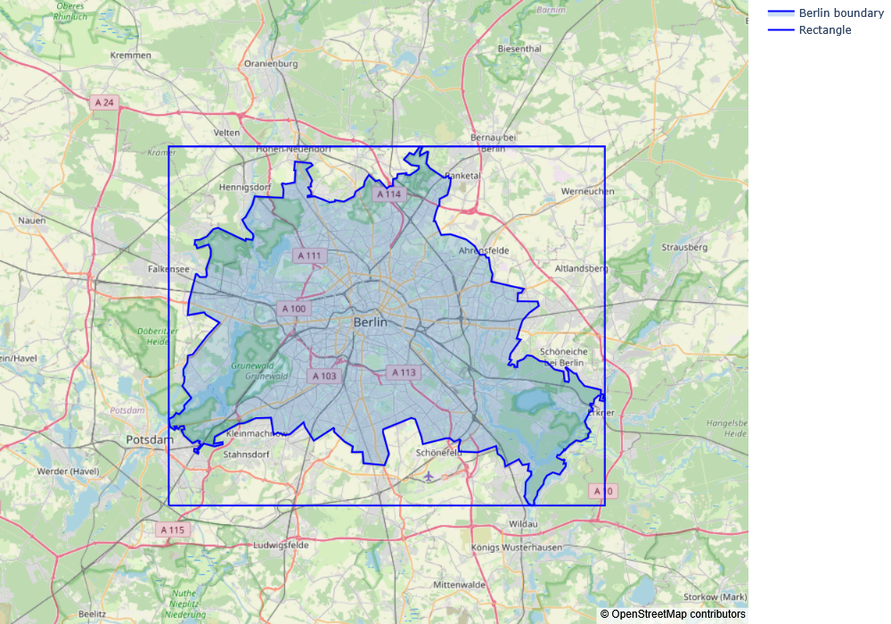
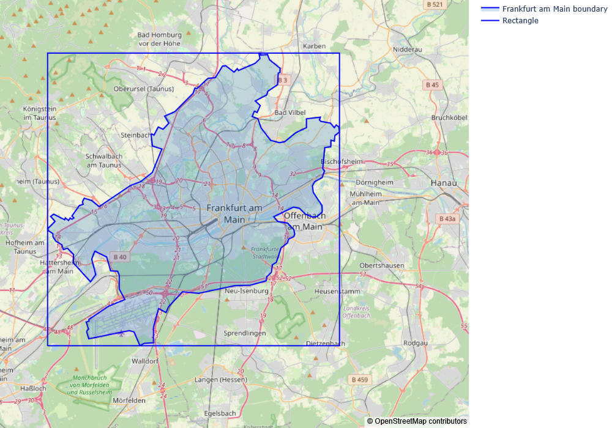
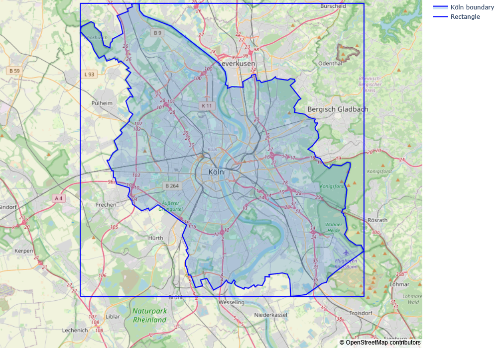
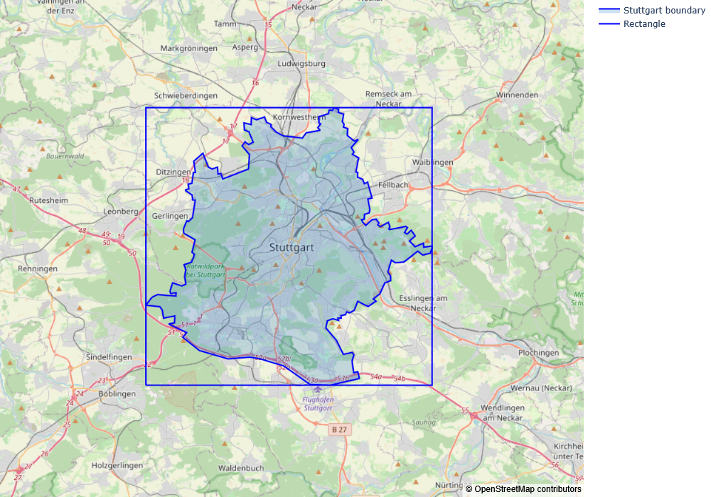

# Geoarea Estimator

## 1 -Objective

This project computes the area of a given region on Earth. The module `geoarea_estimator` uses the boundary of the region and estimates the enclosed area via the Monte Carlo method. It is purely pedagogical in purpose and serves as a simple application of a technique widely employed in statistical modelling.

## 2 - Repo organisation

**`geoarea_estimator/`: The geoarea estimator module**
It contains the `geoarea_estimator` module. See also Module architecture below.

**`maps/:` Map representations of the estimates areas in `test_data`**
- `berlin_map.png`
- `frankfurt_map.png`
- `koln_map.png`
- `stuttgart_map.png`

**`test_data/:` boundary of the regions used to test the module**
- `berlin_boundary.json`
- `frankfurt_boundary.json`
- `koln_boundary.json`
- `stuttgart_boundary.json`

Note: the geospatial data was obtained from [gadm.org](https://gadm.org/). 

## 3 - Module architecture

Description of the `pi_estimator` module architecture.

- `geoarea_estimator/__init__.py`
  - Initialises the module
  - Imports the `GeoRegionArea` class
  
- `geoarea_estimator/geoarea_estimator.py`: defines the `GeoRegionArea` class with the methods
  - `estimate`;
  - `results`.
  
## 4 - Features

- The `GeoRegionArea` class:
  - estimates the value of the area of a given region on Earth using the Monte Carlo method;
  - has the following methods:
    - `estimate` performes the estimation,
    - `results` returns the number of samples used, the final estimation and the confidence interval at 95% confidence level.
   
Note: the confidence interval is computed using the maximum of the Bernoulli's distribution variance (i.e. $\sigma = 1/2$, the "pessimistic approach"). Thus, the sample error is simply given by $1.96/(2\times \sqrt{N_{\rm samples}})$.

 ## 5 - Estimating the area

To estimatime the area enclosed by a given boundary, the module first draws a rectangle on the surface of the Earth using two meridians and two parallels such that it inscribes the boundary. Earth's surface is approximated by a sphere and the area of that retactangle is in this case is given by

$$
A_{\rm rect} = R^2(\sin({\rm lat_{max}}) - \sin({\rm lat_{min}}))({\rm lon_{max} - lon_{min}}).
$$

Here ${\rm lat_{max/min}}$, ${\rm lon_{max/min}}$ are the maximum and minimum latitudes and longitudes of the boundary, respectively. To improve on this approximation, the radius $R$ used in the computation of $A_{\rm rect}$ is the geocentric radius of the ellipsoid with equatorial radius $a$ and polar radius $b$ and is given by

$$
R^2 = \frac{a^4\cos^2({\rm lat_{mean}}) + b^4\sin^2({\rm lat_{mean}})}{a^2\cos^2({\rm lat_{mean}}) + b^2\sin^2({\rm lat_{mean}})},
$$

with ${\rm lat_{mean}} = ({\rm lat_{max}} + {\rm lat_{min}})/2$.

The area of the region enclosed by the boundary is estimated as the fraction $p$ of the the area of the excribed rectangle $A_{\rm rect}$ using the Monte Carlo method. In summary, this method works by randomly sampling points on the rectangle and estimating $p$ as

$$
\hat{p} = \frac{\text{number points within the boundary}}{\text{total number of points}},
$$

see *e.g.* the [`pi-estimator`](https://github.com/wcclima/pi-estimator) repo for a brief discussion on this method. The estimate of the area of the region enclosed by the given boundary is

$$
A_{\rm region} = A_{\rm rect}\times \hat{p}.
$$

To assert that a point fall within the boundary of the region, the module uses the [ray-crossing algorithm](https://en.wikipedia.org/wiki/Point_in_polygon) adapted to the case of a polygon on a sphere, see *e.g.* the [`point_in_polygon`](https://github.com/wcclima/point-in-polygon-problem) repo for a brief discussion on this algorithm. 

 ## 6 - Results

 As a test for the module `GeoRegionArea`, we use the German cities of Berlin, Frankfurt am Main, Köln and Stuttgart. The geospatial data used here can be found in the `test_data` folder of this repo and was originally obtained from [gadm.org](https://gadm.org/).

 - Berlin (area = 891.1 ${\rm km}^2$ )

  
|       quantity      |        value         |
|:-------------------:|:--------------------:|
|       samples       |        100000        |
|     area (km^2)     |       887.9352       |
| conf. interval @95% | [882.6671, 893.2034] |

*Table 1: Results for Berlin.*

  

*Figure 1: Map of Berlin with the excribed rectangle. The shaded area correspond to the estimate*

 - Frankfurt am Main (area = 248.3 ${\rm km}^2$ )

  
|       quantity      |        value         |
|:-------------------:|:--------------------:|
|       samples       |        100000        |
|     area (km^2)     |       245.2742       |
| conf. interval @95% | [243.5818, 246.9666] |

*Table 2: Results for Frankfurt.*

  

  
*Figure 2: Map of Farnkfurt with the excribed rectangle. The shaded area correspond to the estimate*

 - Köln (area = 405.0 ${\rm km}^2$ )

  
|       quantity      |        value         |
|:-------------------:|:--------------------:|
|       samples       |        100000        |
|     area (km^2)     |       402.8263       |
| conf. interval @95% | [400.4236, 405.2291] |

*Table 3: Results for Köln.*

  

  
*Figure 3: Map of Köln with the excribed rectangle. The shaded area correspond to the estimate*

 - Stuttgart (area = 207.3 ${\rm km}^2$ )

  
|       quantity      |        value         |
|:-------------------:|:--------------------:|
|       samples       |        100000        |
|     area (km^2)     |       208.7127       |
| conf. interval @95% | [207.4801, 209.9454] |

*Table 4: Results for Stuttgart.*

  

  
*Figure 4: Map of Köln with the excribed rectangle. The shaded area correspond to the estimate*

 ## 7 - Bibliography

1. N. J. Giordano and H Nakanishi, Computational Physics (Pearson Prentice Hall, New Jersey, 2006).
2. R.H. Landau, M.J. Páez and C.C. Bordeianu, Computation Physics: Problem Solving with Python (Wiley-VCH, Weinheim, 2015).
3. [M. Bevis and J.-L. Chatelain, Locating a point on a spherical surface relative to a spherical polygon of arbitrary shape. *Mathematical Geology* *21*, 811 (1989)](https://link.springer.com/article/10.1007/BF00894449).
